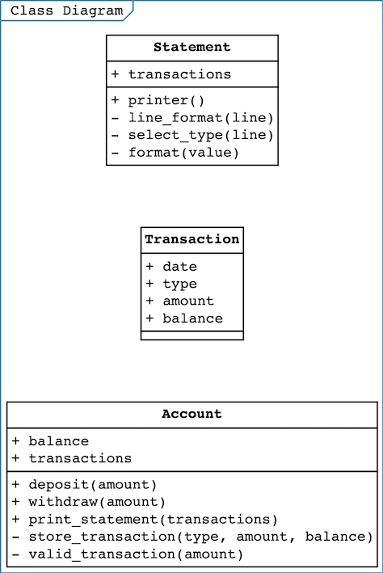

# Bank Tech Test 
It's a command line application in which a bank customer can deposit/withdraw from his account and print his account statement.

 


### Run Bundle


```
$ bundle install
```


## Running the tests


```
$ rspec
```
## User Stories

```
As a Customer
so that I can save my money
I will able to deposit my money in Bank
```
```
As a Customer
so that I can spend my money
I will able to withdraw my money from Bank
```
```
As a Customer
so that I know how much money I have
I will able to print statement of my account
```
```
As a Customer
so that I can check my transactions
I will able be to see date,credit/debit amount and balance in my statement
```
## Class Diagram



## Approach 

* According to the requirements, I have extracted some User stories.
* Using these User Stories made a Class Diagram.
* There are three classes Account,Transaction and Statement.
   * The Account class is from where user interacts.This class has account balance and list of transactions.
     Whenever user wants to deposit or withdraw,a new transaction is initialized.
     When user wants to print statement a new statement is initialized with list of his transactions.
   * The Transaction class have details of transaction like date,type(credit/debit),amount and balance.
   * The Statement class has list of transactions which it uses to print in a particular format.


## Built With

* Ruby
* Rspec

## IRB
```
2.6.5 :001 > require './lib/account.rb'
 => true 
2.6.5 :002 >   account = Account.new
 => #<Account:0x00007fc9830ef138 @balance=0, @transactions=[]> 
2.6.5 :003 >   account.deposit(5000)
 => "Credit of amount £5000 was successfull" 
2.6.5 :004 >   account.deposit(2000)
 => "Credit of amount £2000 was successfull" 
2.6.5 :005 >   account.withdraw(1000)
 => "Debit of amount £1000 was successfull" 
2.6.5 :006 >   account.print_statement
date || credit || debit || balance 
22/04/2020|| || 1000.00 ||6000.00
22/04/2020||  2000.00 || ||7000.00
22/04/2020||  5000.00 || ||5000.00
```


## Requirements

* You should be able to interact with your code via a REPL like IRB or the JavaScript console.  (You don't need to implement a command line interface that takes input from STDIN.)
* Deposits, withdrawal.
* Account statement (date, amount, balance) printing.
* Data can be kept in memory (it doesn't need to be stored to a database or anything).

### Acceptance criteria

**Given** a client makes a deposit of 1000 on 10-01-2012  
**And** a deposit of 2000 on 13-01-2012  
**And** a withdrawal of 500 on 14-01-2012  
**When** she prints her bank statement  
**Then** she would see

```
date || credit || debit || balance
14/01/2012 || || 500.00 || 2500.00
13/01/2012 || 2000.00 || || 3000.00
10/01/2012 || 1000.00 || || 1000.00
```
 
